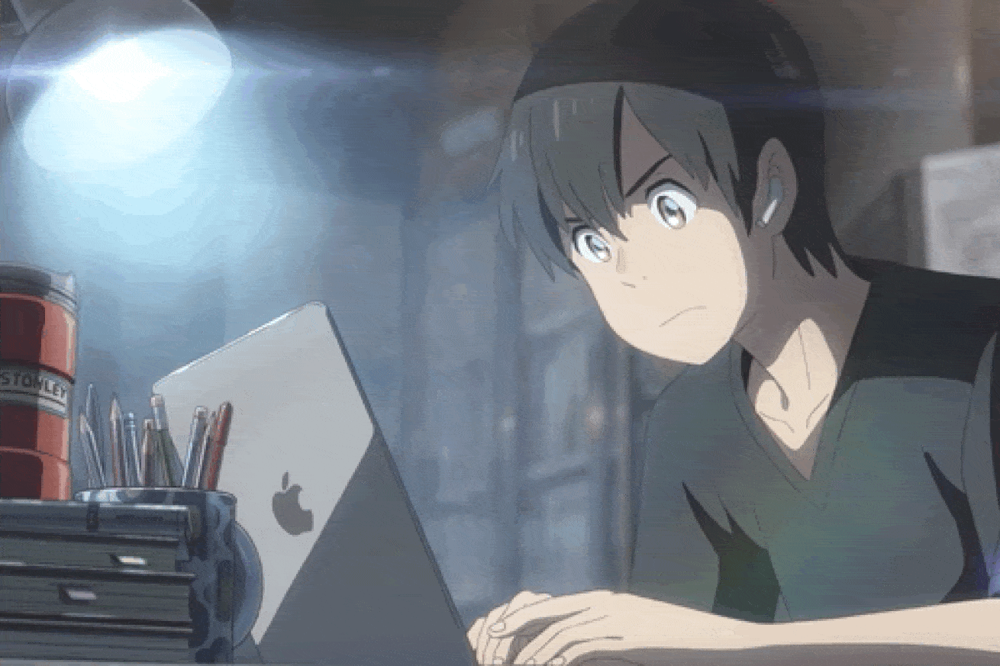

<div align="center">


<br/>
<a href="https://0xkxbyte-bio.netlify.app/"></a>
<a href="https://www.youtube.com/@0xKxbytee"></a>
<a href="https://www.instagram.com/0xkxbyte/"></a>

<br/><br/>


</div>

---

## 👋 whoami

<table>
<tr>
<td width="65%" valign="top">

```ts
const dev = {
  alias      : "0xKxbyte",
  role       : "Full-Stack Developer",
  location   : "Minas Gerais, Brasil 🇧🇷  —  GMT-3  —  Remote Only",
  status     : "freelancer // aberto a proposta fixa (remoto)",
  Services   : "Programador, CyberSecurity, GameDev, Tecnico de Informatica/Servidor",
  alvo       : ["Microsoft", "Itaú", "Bradesco", "Mercado Pago", "e outras"],
  criador    : "cursos, projetos e conteúdo técnico na internet",
  stack      : ["Node.js", "PostgreSQL", "JavaScript", "React", "TypeScript", "Entre Outros"]
};
```

> Desenvolvedor Full-Stack autodidata, freelancer e **em busca ativa de uma posição fixa remota**. Atuo do front-end ao back-end, com experiência complementar em suporte técnico e manutenção de informática. Também crio conteúdo, cursos e projetos de tecnologia na internet.

</td>
<td width="35%" align="center" valign="middle">


</td>
</tr>
</table>

<div align="center">

**🎯 De olho em oportunidades em:**


</div>

---

## 🛠️ Tech Stack

<div align="center">

**Linguagens & Scripting**


<br/>

**Front-End & Web**


<br/>

**Banco de Dados & Cloud**


<br/>

**Design & Ferramentas de Dev**


<br/>


</div>

---

## 📊 GitHub Stats

<div align="center">


</div>

---

## 📬 Contato

<table>
<tr>
<td width="65%" valign="middle">

<div align="center">

<a href="https://0xkxbyte-bio.netlify.app/"></a>
<a href="https://www.youtube.com/@0xKxbytee"></a>
<a href="https://www.instagram.com/0xkxbyte/"></a>

<br/><br/>

**─ Obrigado pela visita 👾🖐️ ─**

</div>

</td>
<td width="35%" align="center" valign="middle">



</td>
</tr>
</table>

---

<div align="center">


*── Criando Tecnologia. Compartilhando Conhecimento. ──*

</div>
