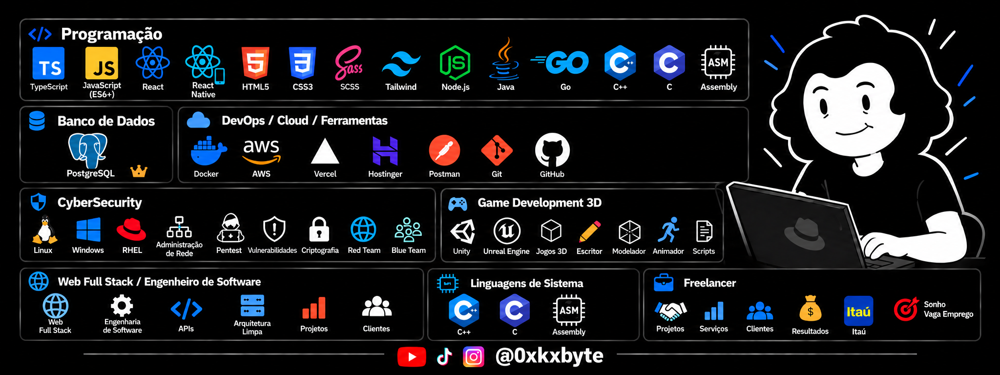

# 0xKxbyte

Programador Web Full Stack, Engenheiro de Software e Cybersecurity.
Minas Gerais, Brasil. Remoto.

Objetivo: trabalhar no Itaú.

---

## Sobre

Desenvolvedor Full Stack com 3 anos de experiência em PostgreSQL, trabalhando do back-end ao front-end, com base em Linux e segurança.

---

## Linguagens e tecnologias

**Principais**

TypeScript, JavaScript Avançado (ES6+), Git/GitHub, Java, Go, Shell/Bash, PostgreSQL (obrigatório)

**Secundárias**

 

**Runtime e Frameworks**

 

**Infraestrutura e Sistemas**

Linux, Red Hat Enterprise Linux (RHEL), Windows, Docker, Vercel, Hostinger

**Em estudo**

**Ferramentas**

---

## Formação

| Curso | Status |
|---|---|
| Programador Web Full Stack | Certificado |
| Programador Web e Websites | Certificado |
| PostgreSQL | Certificado |
| Web Full Stack | Conclusão 11/2026 |
| Engenharia de Software | Conclusão 12/2026 |
| Cybersecurity | Conclusão 01/2027 |
| Administração | Conclusão 08/2027 |

## Idiomas

| Idioma | Nível |
|---|---|
| Português | Nativo |
| Espanhol | Intermediário |
| Inglês | Básico, em evolução |

---

## Palavras-chave

`TypeScript` `JavaScript` `ES6+` `Node.js` `React` `React Native` `Tailwind CSS` `PostgreSQL` `Java` `Go` `Shell` `Bash` `C` `C++` `Assembly` `Git` `GitHub` `Docker` `Vercel` `Hostinger` `Postman` `Figma` `Linux` `RHEL` `Red Hat Enterprise Linux` `Windows` `Cybersecurity` `Full Stack` `Engenharia de Software`

---

## GitHub

---

## Contato

Aberto a oportunidades remotas.

---

*Criando tecnologia. Compartilhando conhecimento.*
